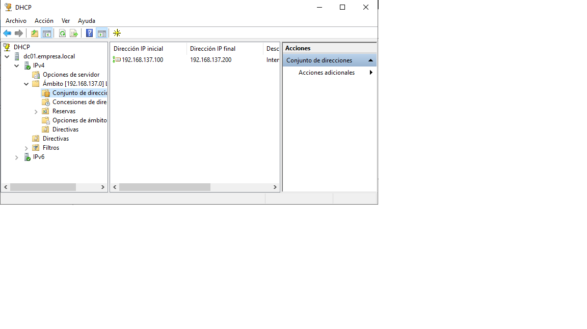
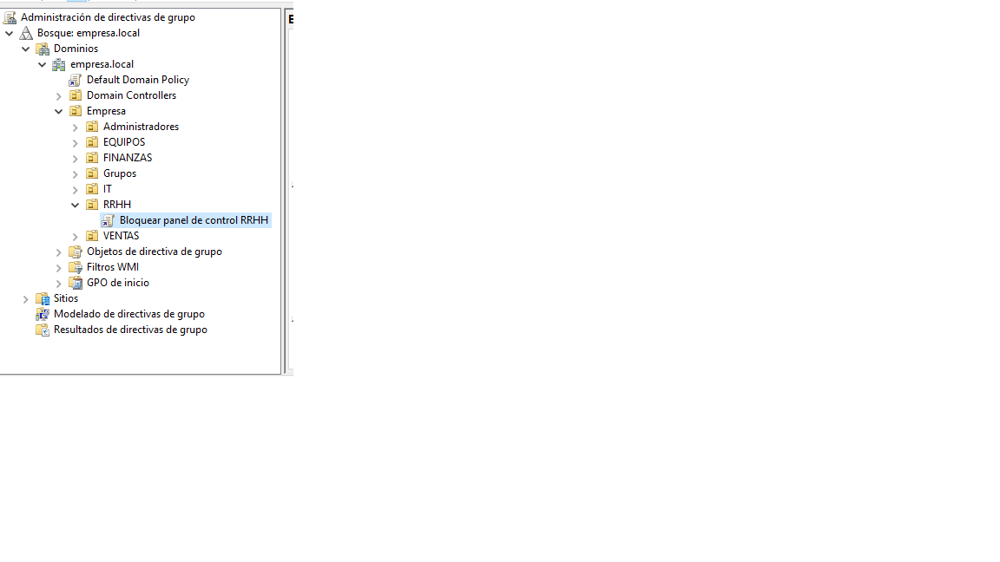
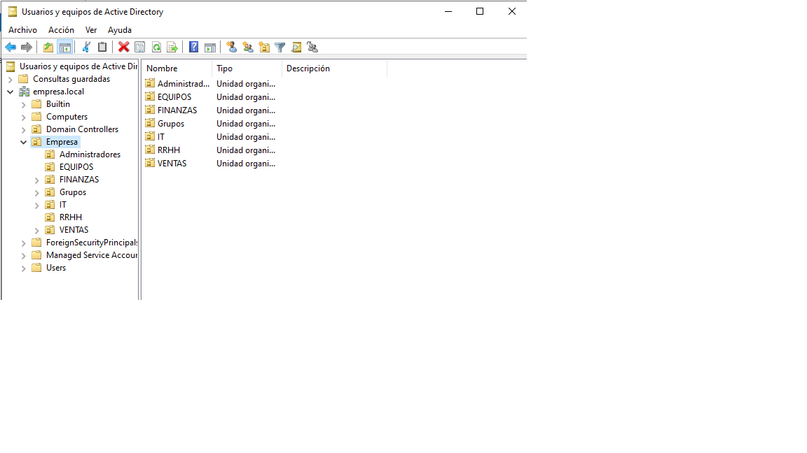
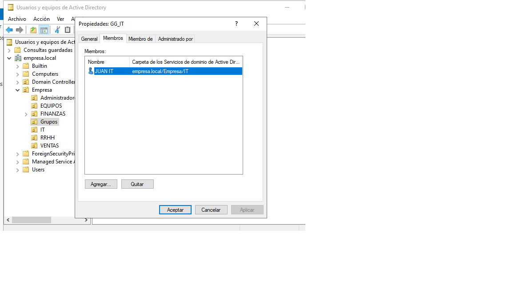

# Proyecto Active Directory con Windows Server 2022

## Descripción

Laboratorio práctico realizado como parte de la formación en ASIR con el objetivo de simular la infraestructura básica de una pequeña empresa mediante una red virtual aislada.

El entorno ha sido desplegado utilizando VMware Workstation y está compuesto por un controlador de dominio con Windows Server 2022 y un equipo cliente con Windows 11, sobre los que se han implementado servicios y tareas habituales de administración de sistemas.

> Este proyecto está basado en un entorno de laboratorio con direcciones IP privadas, nombres ficticios y una empresa inventada con fines educativos.

---

## Objetivos del proyecto

- Desplegar un dominio Active Directory.
- Configurar un controlador de dominio.
- Integrar DNS con Active Directory.
- Implementar DHCP para asignación dinámica de direcciones IP.
- Crear y administrar usuarios y grupos.
- Diseñar una estructura organizativa mediante unidades organizativas (OU).
- Aplicar directivas de grupo (GPO).
- Unir equipos Windows al dominio.
- Configurar carpetas compartidas y permisos.
- Documentar incidencias y tareas de troubleshooting.

---

## Tecnologías utilizadas

- VMware Workstation
- Windows Server 2022 Standard Evaluation
- Windows 11 Pro
- Active Directory Domain Services (AD DS)
- DNS Server
- DHCP Server
- Group Policy Objects (GPO)
- PowerShell

---

## Arquitectura del laboratorio

```text
                 VMware NAT
                10.0.0.1
                      |
        -----------------------------------
        |                                 |
     DC01                              PC01
Windows Server 2022               Windows 11 Pro
10.0.0.10                         DHCP dinámico
AD DS
DNS
DHCP

Dominio: empresa.local

## Capturas del laboratorio

### 1. Concesiones de direcciones


### 2. DHCP


### 3. Directiva de grupo


### 4. DNS


### 5. Dominio


### 6. Estructura de Active Directory


### 7. Grupos


### 8. Miembros de grupo


### 9. Ping


### 10. Usuario


### 11. Usuarios


